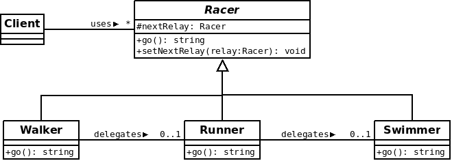

# Synopsis

Imagine a long relay race with athletes from different sports. This race could involve several teams composed each time of a racewalker, a runner and a swimmer.

# Problem

Each sport has its own rules and each athlete will participate differently. So we cannot just evaluate the role of each athlete in the same way, even though the objective is the same for everyone within a team: the gold medal. A swimmer and a runner are both athletes, but a swimmer swims whereas a runner runs... Here we could say that each team member handles a part of the initial request which is to win the race.

Moreover, this is a relay race, not an individual one. Each athlete must know the next relay where another athlete will wait for the baton before to start.

# Solution

Everytime a request should be handled by multiple (and complementary) processing units, the Chain of Responsibility pattern seems ideal. In this case, this pattern requires:

  * An abstract representation of a racer (abstract class or interface)
  * Concrete racers (Walker, Runner, Swimmer)
  * Composition because each racer "class" must have a reference to the next relay (except for the last athlete who crosses the finish line)

