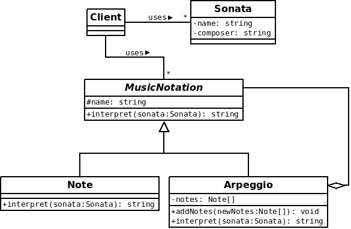

# Synopsis

I love music and I want to be able to analyze some compositions like "Moonlight Sonata" by Beethoven.

# Problem

Music is a beautiful but complex universe, and listening to music does not mean understanding it. To analyze compositions, music theory is an absolute necessity. Since music is a language, pretty much like English or French are, it has its own grammar. Understanding this grammar makes it possible to understand a composition. But here the question is: how do we describe a grammar with a programming language?

# Solution

The Interpreter pattern is exactly what we need to tell JavaScript how to interpret music grammar. Here we can have:

  * A concrete context to analyze, which will be a sonata (e.g. "Moonlight Sonata")
  * An abstract representation of music notation (abstract class or interface)
  * Concrete (terminal and nonterminal) expressions like Note or Arpeggio

The distinction between terminal and nonterminal expressions in the Interpreter pattern is a bit like the distinction between simple and composed elements in the Composite pattern. A note is a terminal expression because it is an "elementary symbol" of the grammar. However, an arpeggio is a nonterminal expression because it can be considered as a group of notes.

