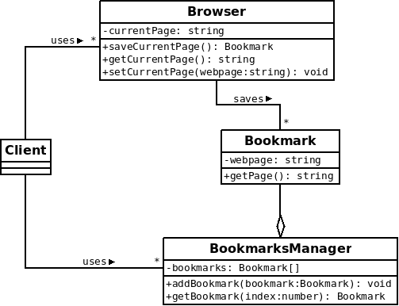

# Synopsis

I found an interesting article on the Web and I would like to save it in my browser for later reading. For some reasons, I always use private browsing.

# Problem

With private browsing, history is not kept by the browser. Of course we can use back and forward buttons to navigate in the current history during the browsing session, but with this technique, it would not be possible to identify easily our favorite webpages. Furthermore, interesting webpages would not be there anymore if we close the browser and open it again.

# Solution

Here we have to use bookmarks to save interesting webpages and the Memento pattern allows us to simulate that behavior. Implementing this pattern requires:

  * A concrete "originator" (the browser) which is responsible for the action
  * A concrete "memento" (a bookmark) which keeps the link to the interesting webpage
  * A concrete "caretaker" (the bookmarks manager) which keeps a list of bookmarks

