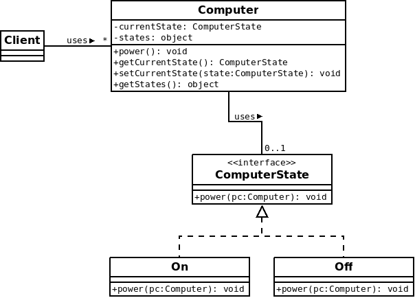

# Synopsis

On any computer, I can see a power button. Generally, when the button is pressed while the computer is off, the computer is turned on. And when the button is pressed while the computer is on, the computer is turned off.

# Problem

A computer has two basic states: on and off. So when you press the power button, the system must be smart enough to understand when the computer is on and when it is off. It should also be smart enough to change its own state when the button is pressed.

# Solution

The State design pattern is obviously what we should use here. Here we need: 

  * An abstract representation of a computer state (abstract class or interface)
  * A concrete computer which is actually the context
  * Concrete states (on/off)

Contrary to the Strategy pattern, we can access the context directly from the concrete states. This allows state changes from states themselves.

