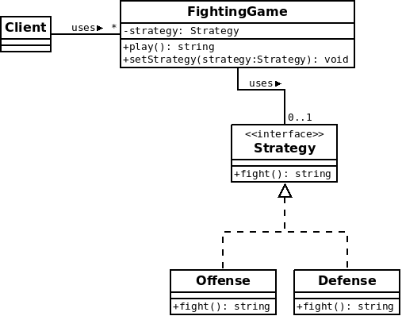

# Synopsis

I am playing a fighting game and I do not know my opponent. Should I prefer an offensive or defensive style? 

# Problem

Since the opponent is unknown, the player has to choose a fighting strategy on the fly.
In programming terms, we can say that an algorithm has to be selected at runtime, among several available algorithms.

# Solution

The Strategy design pattern is exactly what we need in this kind of situation. To implement this pattern, we can have:

  * A concrete context (FightingGame) which contains a reference to a strategy
  * An abstract representation of a strategy (abstract class or interface)
  * Concrete strategies (Offense & Defense)

