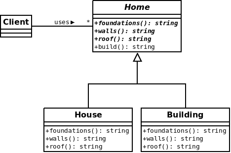

# Synopsis

I am a construction professional and I always respect the basic principles of my job. I build houses and buildings following the common sense.

# Problem

Building something like a house is not trivial. It is very technical and, if you are not a construction professional, you may do things in the wrong order. For example, you could be tempted to build walls on a ground that is not fully prepared, leading to weak foundations.

# Solution

Even for professionals, it is good to have a template (like a plan drawn by an architect). This template makes it clear that you have to work on foundations first, then build walls and finally put the roof.

The Template design pattern is an ideal candidate to express with code this kind of situation. For this pattern, we need:

  * An abstract representation of a construction (abstract class is preferred because it makes it possible to implement the template method which will be the same for every type of construction)
  * Concrete constructions (House & Building)

Most methods on the abstract class are abstract and are implemented in concrete constructions.

