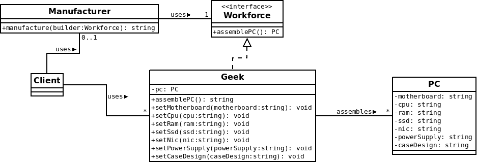

# Synopsis

I have to buy a new PC, but not a standardized one. On the manufacturer's website, I chose every single component before validating my order. Now I am looking forward to using this new computer!

# Problem

A PC contains a lot of components, which suppose a large number of arguments in its constructor. For the client code, this will be difficult to use and not very intuitive (see the telescoping constructor anti-pattern).

# Solution

The Builder pattern allows us to build our PC step by step. This pattern requires:

  * An abstract builder (abstract class or interface)
  * A concrete builder (here a geek, who is responsible for assembling PCs)
  * A director (here a manufacturer, which will delegate the work to the geeks in the staff)
  * A product (PC), the entity to build

N.B. Building an object step by step is easy in JavaScript. It is in the language DNA (see object literals). In practice, the Builder design pattern is not really interesting in this language, at least in its "class" form. We could consider it when we need encapsulation, but most of the time, the "options object pattern" is a much better and convenient solution.
