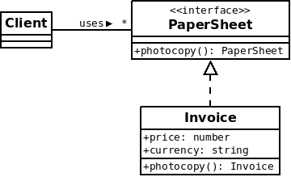

# Synopsis

When I order something, I sometimes like to have a paper invoice.
But when the order is important, I do not want to lose the document.
Therefore, I want to be able to make photocopies.

# Problem

Creating a new object with "new" is not the same thing as cloning an existing object.
The good point about JavaScript is that the language is prototype-based.
The built-in Object.create() method already performs some kind of cloning.
However, we cannot clone properly if we only use Object.create().
The parameter of this method (the original object) is used as the prototype of the new object.
This means the new object will not have own properties like the original object.
These properties would be available in the new object, but in its prototype.

# Solution

When we want to clone an existing object, the Prototype pattern can come to the rescue.
To implement it in JavaScript, we can:

  * Create an abstract representation of the cloneable object ("PaperSheet") with an abstract clone method ("photocopy")
  * Create a concrete implementation ("Invoice") with a true definition of the clone method ("photocopy")

In the clone method, we can:

  * Get the prototype of the original object separately with Object.getPrototypeOf()
  * Create a new object from this prototype with Object.create()
  * Merge the own properties of the original object with the inherited properties of the newly created object

