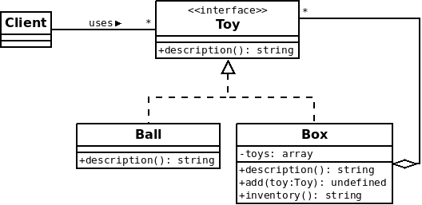

# Synopsis

My little brother's room is generally a big mess, but recently my mother bought him some funny toy boxes of different sizes (like a 3D puzzle) so he can put his toys in it.

# Problem

Here a toy box is, to some extent, a toy in itself that can contain other toys. These toys can be simple ones like, for instance, balls. But they can be complex ones too, like smaller toy boxes which also may contain other balls and/or even smaller toy boxes, etc. This situation is not easy to describe through code...

# Solution

A good idea is to consider a group of toys like a simple toy. So a toy box full of toys is just a toy after all!

The Composite design pattern is useful in this kind of situation. To implement this one, we need:

  * An abstract representation of a toy (abstract class or interface)
  * Concrete toys, especially a simple one (ball) and a complex one (toy box)
  * Methods for the complex toy to manage (simple and complex) toys inside of it

