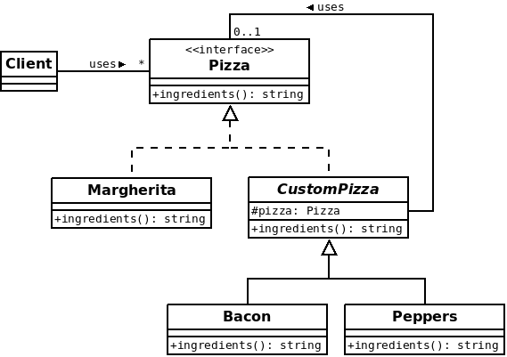

# Synopsis

I am hungry and I want to eat pizza. I take my car and go to the nearest pizzeria. After a couple of minutes looking at the menu, I do not find what I want. So I finally ask for a custom pizza that will be prepared on the fly. I am not quite sure of the ingredients I want, but let's try to make a tasty pizza!

# Problem

A custom pizza could be anything. Ingredients will be added one by one to produce something unique, depending on my choices.
Here a pizza is an object that is built at runtime, which means that we cannot have an exhaustive constructor with all possible ingredients as parameters. 

# Solution

The idea is to "augment" a basic product (such as a Margherita) with some extras (Bacon, Peppers, ...) using the Decorator design pattern.
To make this working, we need:

  * An abstract representation of a Pizza (abstract class or interface)
  * A concrete implementation of this abstraction (like a simple pizza which will be decorated with ingredients)
  * An abstract representation of a custom pizza (abstract class which is actually the abstract decorator)
  * Concrete decorators (ingredients) that will be used to add new flavors to a more basic pizza

N.B. JavaScript is a very flexible language. Whenever we need to build something step by step or add new functionalities dynamically to an object, we can do it more easily using the idiomatic mechanisms of JavaScript (which is not a class-based language). Class-style programming is a matter of taste here and may be useful when we need more encapsulation. However, the best solution is often the simplest one...
