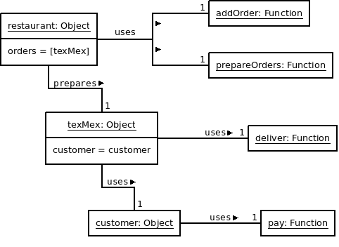

# Synopsis

I am hungry and I decide to call the nearest Tex-Mex restaurant to place an order. I hope I will receive my meal fast.

# Problem

Placing an order is easy to do. As a customer, you only need to say what you want to eat and nothing else. However, for the restaurant, there is a true organization behind the scenes to effectively treat your order. The chef cooks for you, then the meal is packaged and finally the delivery man brings it to you as fast as possible. Plus, you are not the only one to be hungry... The restaurant is most likely in a situation where it has to handle many orders, especially when it is time for dinner.

In computer science terms, it seems obvious that the restaurant has to handle a queue of orders and that each customer is a unique entity. Since a customer normally pays his order to the delivery man, the payment should be the last step of the process. But this is not so intuitive if you try to find a good code organization for this. On the one hand, all orders are handled by the restaurant and everything required to prepare these orders is like encapsulated in each order. On the other hand, only customers can validate orders since their responsible for payment.

# Solution

The Command pattern is a great help here. In this pattern terminology, we will say that:
 
  * The restaurant is the "invoker" who creates and handles new orders internally.
  * The order is the "command", in other words the request which comes from a client.
  * The customer is the "receiver" of the order.

To implement this pattern, we then need three object literals to represent each entity:
  
  * The customer has only one method ("pay").
  * The order has a reference to a given customer and makes him pay using its "deliver" method.
  * The restaurant is a more complex object with a collection (array) of orders and an essential method ("prepareOrders") that start the delivery of each order.

