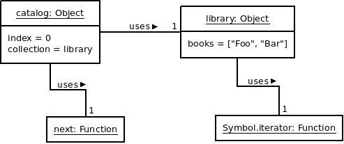

# Synopsis

I am at the library and I would like to see the list of all available books.

# Problem

There is generally a huge amount of books in a library, so it is great to have a catalog that allows you to have a quick overview of all available references. This catalog may be a bit special and could contain a one-page presentation for each book.

In Javascript, we could use a simple loop to get the list of all books. But in fact, this would not be so convenient because each data structure and entity may have its own particularities when it comes to iteration. For instance, we know we cannot iterate through an array literal like we iterate through an object literal (array-like objects could be considered as an exception). Therefore this is generally a good idea to simplify the work to iterate through a collection...

# Solution

Iterator is the design pattern we need for this. To implement this pattern, we could have:

  * An object literal containing an index property and at least a method named "next"
  * A very basic object literal representing a library (which is a collection of books) 

In this particular case, a collection is an iterable object whereas a catalog is an iterator object.

