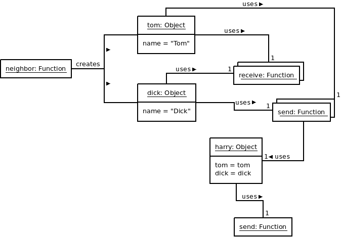

# Synopsis

Tom and Dick are neighbors. Dick makes a lot of noise on Sunday mornings, which drives Tom crazy. Communication has become difficult between them because of this.

# Problem

If Tom and Dick cannot talk to each other directly, Dick will continue to make noise and Tom will get angry every Sunday.

# Solution

When communication is difficult between two objects or in a system (here the neighborhood), the solution is delegation to a third-party object. This object will make communication easier between all other objects.

This is exactly the solution proposed by the Mediator pattern. To implement this pattern, we need:

  * Object literals to represent Tom and Dick (who are neighbors)
  * An object literal to represent Harry (who is the mediator)

Tom and Dick have both a "send" and "receive" methods, but they do not communicate directly. They communicate through the mediator who acts a bit like a router. Thus, Harry must have a reference to both neighbor objects and, depending on the sender, he will know the receiver... 

