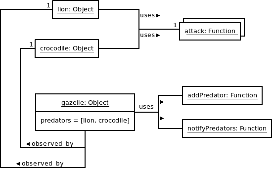

# Synopsis

In the savanna, there are predators like lions or crocodiles and there are preys like gazelles. So lions and crocodiles often attack gazelles.

# Problem

Lions and crocodiles do not attack at any moment. A lion will generally attack if a gazelle is a bit too far from the herd. A crocodile will generally attack if a gazelle is a bit too close to water, especially for drinking.

In programming terms, predators execute some action when a specific event occurs on the preys side. This implies the implementation of an event-handling mechanism in the code, which may be unclear if it is not properly done.

# Solution

The Observer design pattern helps a lot when we have to implement an event-driven system like this. Here this pattern is composed of:

  * Object literals to represent different kinds of observers
  * An object literal to represent the observable entity 

The observable object (gazelle) maintains a list (array) of predators. Then, depending on its actions (determined by the client code), its "notifyPredators" method may be called. This method would iterate through the array of predators and make them attack.

