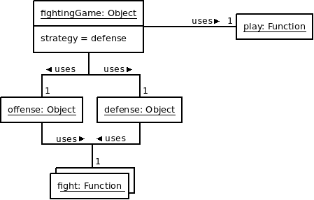

# Synopsis

I am playing a fighting game and I do not know my opponent. Should I prefer an offensive or defensive style? 

# Problem

Since the opponent is unknown, the player has to choose a fighting strategy on the fly.
In programming terms, we can say that an algorithm has to be selected at runtime, among several available algorithms.

# Solution

The Strategy design pattern is exactly what we need in this kind of situation. To implement this pattern, we can have:

  * An object literal to represent the context (the fighting game)
  * Object literals to represent available strategies (offense and defense)

Offensive and defensive strategies seem to share a "fight" method, but the performed action is obviously different. Moreover, the context (fighting game) must have a reference to the current strategy because its main method ("play") is directly influenced by the selected strategy in the client code.

