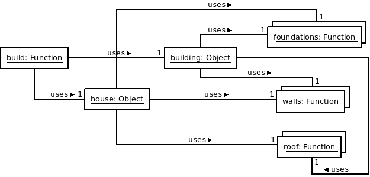

# Synopsis

I am a construction professional and I always respect the basic principles of my job. I build houses and buildings following the common sense.

# Problem

Building something like a house is not trivial. It is very technical and, if you are not a construction professional, you may do things in the wrong order. For example, you could be tempted to build walls on a ground that is not fully prepared, leading to weak foundations.

# Solution

Even for professionals, it is good to have a template (like a plan drawn by an architect). This template makes it clear that you have to work on foundations first, then build walls and finally put the roof.

The Template design pattern is an ideal candidate to express with code this kind of situation. For this pattern, we need:

  * Object literals to represent common constructions (house & building)
  * A general function that can be used as a template

Constructions expressed with object literals should have common methods like "foundations", "walls" or "roof" that symbolize key steps in every construction project. Then the template function can be used in the client code, passing it a construction as argument. This template function will create a house or a building by calling each method of the given construction in the right order.

