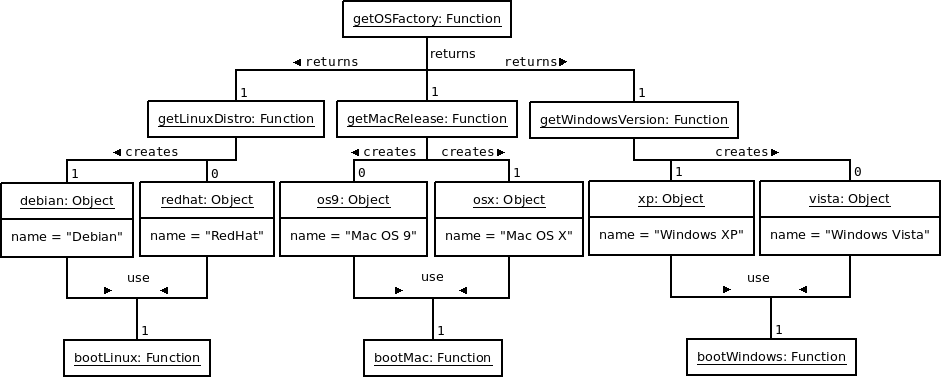

# Synopsis

I am a sysadmin and I work for a company where each employee can choose its operating system. So I often need to install and run various operating systems based on GNU/Linux, Mac OS or Windows.

# Problem

There are several families of operating systems and there are many operating systems in each family.
If we try to handle all the instantiation logic in the client code, it will most likely be a mess.

As a system administrator, you only want to know how to get an instance of a specific OS in a given family. You do not need to know how Debian, Mac OS X or Windows XP have been programmed to make them available on some computers.

# Solution

AbstractFactory is a great solution here. We could consider it as a superset of the Factory pattern, but there is significantly more work to do. Indeed, we need a factory function for each OS family and of course a factory of factories that will be the entry point of the associated module.

