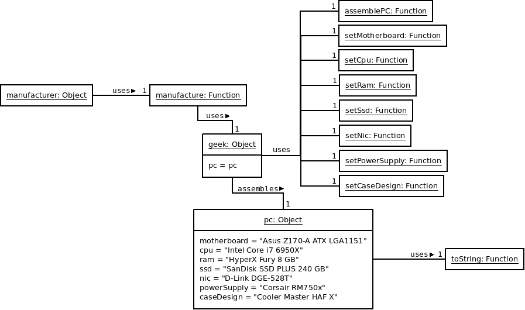

# Synopsis

I have to buy a new PC, but not a standardized one. On the manufacturer's website, I chose every single component before validating my order. Now I am looking forward to using this new computer!

# Problem

A PC contains a lot of components that are dynamically assembled by a third-party workforce which is employed by a manufacturer. Due to the flexibility of JavaScript, it would be possible to have only one object (the PC) and manipulate its properties directly. But this is not ideal if we want to keep the basic structure of the problem that comes from a real-life situation.

# Solution

The Builder pattern allows us to build our PC step by step with only three objects (literals):

  * The PC
  * The workforce (e.g. a geek)
  * The manufacturer

When the manufacturer will receive an order, it will ask its workforce to build the custom PC step by step through its "manufacture" method.

N.B. Since we do not use constructor functions in the idiomatic style, this version of the Builder pattern is not a solution to the telescoping constructor problem. But you might be interested in the "Object Specifier" pattern...
