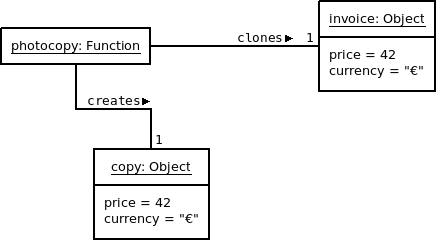

# Synopsis

When I order something, I sometimes like to have a paper invoice.
But when the order is important, I do not want to lose the document.
Therefore, I want to be able to make photocopies.

# Problem

Creating a new object with "new" is not the same thing as cloning an existing object.
The good point about JavaScript is that the language is prototype-based.
The built-in Object.create() method already performs some kind of cloning.
However, we cannot clone properly if we only use Object.create().
The parameter of this method (the original object) is used as the prototype of the new object.
This means the new object will not have own properties like the original object.
These properties would be available in the new object, but in its prototype.

# Solution

We need only two things in this situation:

  * An object (literal) that we want to clone (e.g. invoice)
  * A custom cloning function that will take the object to clone as a parameter

N.B. Most of the time, it is not even useful to have an exact copy of an object in JavaScript. The important thing is often to be able to use the same properties on several objects, and for that purpose, a simple Object.create() is generally good enough.
