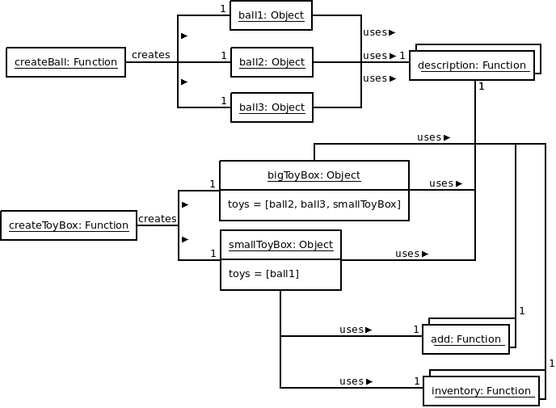

# Synopsis

My little brother's room is generally a big mess, but recently my mother bought him some funny toy boxes of different sizes (like a 3D puzzle) so he can put his toys in it.

# Problem

Here a toy box is, to some extent, a toy in itself that can contain other toys. These toys can be simple ones like, for instance, balls. But they can be complex ones too, like smaller toy boxes which also may contain other balls and/or even smaller toy boxes, etc. This situation is not easy to describe through code...

# Solution

A good idea is to consider a group of toys like a simple toy. So a toy box full of toys is just a toy after all!

The Composite design pattern is useful in this kind of situation. To implement this one, we only need two factory functions. The first one will be responsible for the creation of simple toys (balls), whereas the second one will be responsible for the creation of composite toys (toy boxes). In the object returned by the more complex factory function, we should have at least a collection of toys (an array is fine) and a method that makes it possible to iterate through it. But since the collection can also contain another toy box (that contain itself a collection of toys), this method must be able to iterate deeper.

